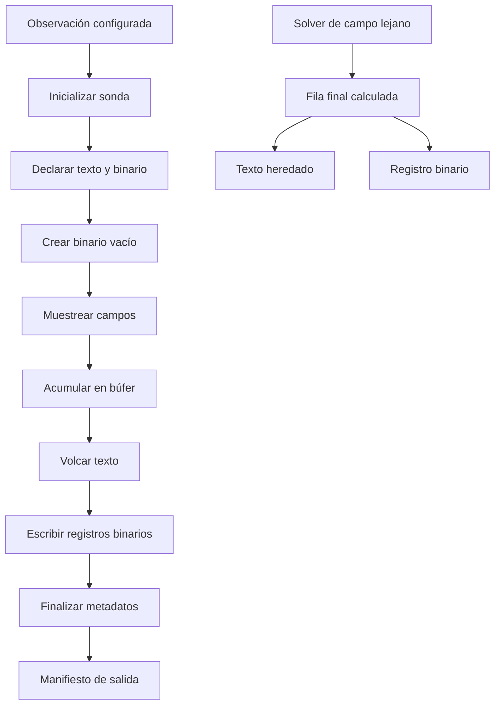
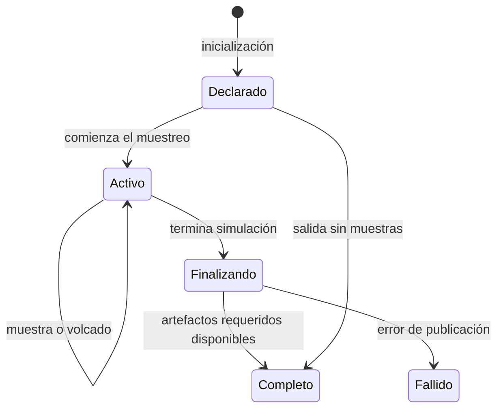
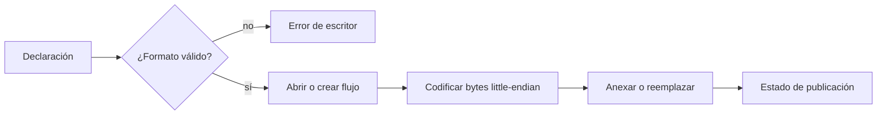
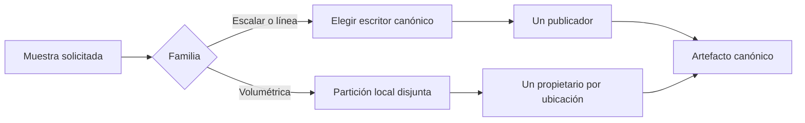

# Guía de Implementación de Salida Binaria de Sondas

## Propósito

Esta guía documenta los cambios que añaden resultados binarios a las sondas
muestreadas, sin eliminar sus resultados de texto o visualización.
Incluye sondas de punto, hilo, bloque, línea, campo lejano y volumétricas.
La salida exclusivamente geométrica no cambia.

## Flujo de Salida



`output_m` coordina el ciclo de vida.
Cada módulo de sonda conserva la responsabilidad de recoger sus muestras y
publicar sus datos.
`outputTypes_m` define el contrato del artefacto y `outputBinary_m` codifica
valores little-endian.

El campo lejano es una excepción deliberada.
Sus valores finales solo existen dentro de `FlushFarfield`, por lo que el solver
escribe su registro binario directamente y no reconstruye datos desde texto.

## Ciclo de Vida



Los artefactos binarios escalares se crean durante la inicialización.
Por tanto, un archivo binario vacío representa una sonda válida sin muestras y
no una salida ausente.

## Contrato Binario

Cada `output_artifact_t` binario declara:

- Ruta relativa y tipo de artefacto.
- Rol canónico o de fragmento.
- Orden de bytes.
- Representación numérica y de complejos.
- Tamaño del registro.
- Orden de componentes.

Los registros nuevos usan IEEE `float64` little-endian.
La compilación por defecto mezcla valores de campo de precisión simple con
tiempo y valores complejos de precisión doble.
Usar un único ancho `float64` evita perder precisión al combinar esos valores
en un registro.



## Formatos de Registro

Todas las entradas son `float64` little-endian.

| Sonda o serie | Orden de componentes | Bytes |
|---|---|---:|
| Punto temporal | `time,value` | 16 |
| Punto en frecuencia | `frequency,value.real,value.imag` | 24 |
| Carga de hilo | `time,charge` | 16 |
| Corriente de hilo | `time,current,delta_voltage,plus_voltage,minus_voltage,voltage_difference` | 48 |
| Bloque | `time,value` | 16 |
| Línea | `time,line_integral` | 16 |
| Volumétrica temporal | `time,x,y,z,Ex,Ey,Ez` | 56 |
| Volumétrica en frecuencia | `frequency,x,y,z,Ex.real,Ex.imag,Ey.real,Ey.imag,Ez.real,Ez.imag` | 80 |
| Campo lejano | `frequency,theta,phi,Etheta.magnitude,Etheta.phase,Ephi.magnitude,Ephi.phase,RCS.arithmetic,RCS.geometric` | 72 |

Las sondas volumétricas de componente específico conservan los componentes no
usados como cero dentro de su registro vectorial de tamaño fijo.
El campo lejano usa magnitud y fase, igual que su salida textual existente.

## Cambios por Familia

### Punto

`point_probe_output_t` reserva cuatro artefactos cuando se solicitan ambos
dominios: texto y binario para tiempo, y texto y binario para frecuencia.
Los registros temporales se anexan en cada volcado.
Los registros de frecuencia reemplazan el resultado integrado completo.

### Hilo, Bloque y Línea

Las sondas de corriente y carga de hilo, de bloque y de línea conservan texto y
anexan registros binarios después de una escritura de texto correcta.
Los registros de línea cambiaron de `float32` a `float64`.
Los búferes de hilo y bloque solo se limpian cuando la publicación binaria tiene
éxito.

### Volumétrica

`movieProbeOutput_m` convirtió sus registros a siete `float64` por muestra.
`frequencySliceProbeOutput_m` convirtió sus registros a diez `float64`, con
pares real/imaginario para cada componente vectorial.
Ambas mantienen sus artefactos de visualización.

### Campo Lejano

`farfield_m` crea un archivo `.bin` junto al resultado de texto y escribe una
fila de nueve `float64` para cada resultado angular final.
`farFieldProbeOutput_m` declara el archivo y su formato en los metadatos.

## Propiedad Distribuida



La funcionalidad binaria reutiliza la selección de propietario para puntos, las
reglas de interfaz de línea y las particiones volumétricas existentes.
Así evita escrituras concurrentes y duplicados en las fronteras.

## Archivos Modificados

| Área | Archivos principales |
|---|---|
| Contrato | `src_output/outputTypes.F90` |
| Escritor portable | `src_output/outputBinary.F90` |
| Sondas escalares | `src_output/pointProbeOutput.F90`, `src_output/wireProbeOutput.F90`, `src_output/bulkProbeOutput.F90`, `src_output/lineProbeOutput.F90` |
| Sondas volumétricas | `src_output/movieProbeOutput.F90`, `src_output/frequencySliceProbeOutput.F90` |
| Campo lejano | `src_main_pub/farfield.F90`, `src_output/farFieldProbeOutput.F90` |
| Pruebas | `test/unit/output/output_tests.h`, `test/unit/output/test_output_binary.F90`, `test/unit/output/test_probe_output.F90` |

## Validación

Las pruebas cubren selección de precisión, registros complejos, anexado
`float64`, publicación de punto, hilo, bloque y línea, artefactos sin muestras,
tamaño de fila de campo lejano, registros volumétricos y contratos de partición.

Ejecutar:

```bash
build/bin/fdtd_tests --gtest_filter='output.*'
```

En esta implementación, las 52 pruebas de salida pasaron.

## Uso por Consumidores

- Resolver la ruta binaria desde los metadatos, no desde convenciones de nombre.
- Interpretar las columnas con `component_order`.
- Usar `record_bytes` para leer registros completos.
- Aplicar el orden de bytes y la representación de complejos declarados.
- Mantener los resultados de texto para revisión manual o flujos existentes.
