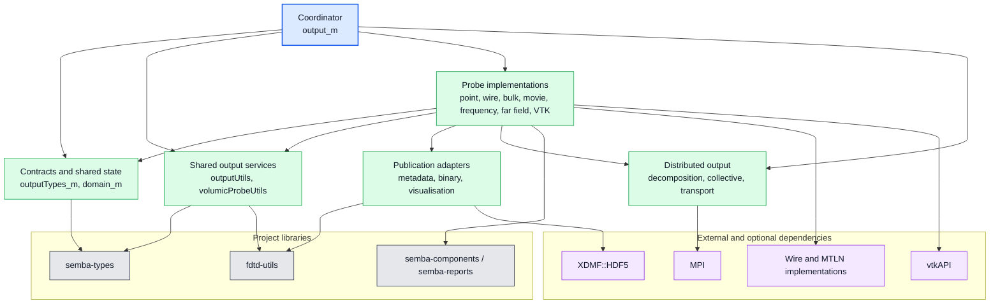

# Output Module Dependencies

This diagram records the direct source-level dependencies of `src_output`.
It also shows the target-level dependencies that CMake uses to assemble the
output library.

Solid arrows represent direct Fortran `use` relationships or direct CMake
target links.
Dotted arrows are conditional dependencies enabled by compile options.
The diagram uses top-to-bottom dependency layers and gently curved connectors
to reduce long diagonal crossings without making the arrows overly square.

## Architectural Overview

Use this view first.
It groups the implementation into dependency boundaries instead of showing
every individual import.

The detailed graph below is the audit view.
It preserves direct source and CMake relationships, but should not be used as
the primary architecture diagram.

## Direct Module Graph

```mermaid
%%{init: {"flowchart": {"curve": "monotoneY"}}}%%
flowchart TB
  subgraph OUT["src_output / fdtd-output"]
    direction TB
    subgraph COORD["Coordinator and contracts"]
      direction LR
      OM["output_m\noutput.F90"]
      OT["outputTypes_m\noutputTypes.F90"]
    end
    subgraph SERVICES["Shared services"]
      direction LR
      OU["outputUtils_m\noutputUtils.F90"]
      DOM["domain_m\ndomain.F90"]
      VP["volumicProbeUtils_m\nvolumicProbeUtils.F90"]
      OP["outputDecomposition_m\noutputDecomposition.F90"]
      OC["outputCollective_m\noutputCollective.F90"]
      OTR["outputTransport_m\noutputTransport.F90"]
      OMETA["outputMetadata_m\noutputMetadata.F90"]
      OBIN["outputBinary_m\noutputBinary.F90"]
      OVIS["outputVisualisation_m\noutputVisualisation.F90"]
    end
    subgraph PROBES["Probe implementations"]
      direction LR
      PP["pointProbeOutput_m\npointProbeOutput.F90"]
      WP["wireProbeOutput_m\nwireProbeOutput.F90"]
      BP["bulkProbeOutput_m\nbulkProbeOutput.F90"]
      MP["movieProbeOutput_m\nmovieProbeOutput.F90"]
      FP["frequencySliceProbeOutput_m\nfrequencySliceProbeOutput.F90"]
      FF["farFieldOutput_m\nfarFieldProbeOutput.F90"]
      MV["mapVTKOutput_m\nmapVTKOutput.F90"]
    end
  end

  subgraph PROJ["Project libraries"]
    TYPES["semba-types\nFDETYPES_m"]
    REPORTS["semba-reports\nreport_m"]
    COMPONENTS["semba-components\nfarfield_m + solver components"]
    UTILS["fdtd-utils\nutils_m, allocationUtils_m, directoryUtils_m"]
  end

  subgraph EXT["External and conditional dependencies"]
    XDMF["XDMF::HDF5\nxdmf_hdf5_m"]
    MPI["MPI::MPI_Fortran\nmpi"]
    MTLN["MTLN solver\nWire_bundles_mtln_m"]
    WIRES["Wire implementations\nHolland / Berenger / Slanted"]
    INTRINSIC["Fortran intrinsics\niso_fortran_env"]
    VTK["vtkAPI target\nvtkAPI_m"]
  end

  OM --> OT
  OM --> OU
  OM --> DOM
  OM --> OP
  OM --> OC
  OM --> OTR
  OM --> OMETA
  OM --> PP
  OM --> WP
  OM --> BP
  OM --> MP
  OM --> FP
  OM --> FF
  OM --> MV
  OM --> TYPES
  OM --> REPORTS
  OM --> UTILS
  OM -. "CompileWithMTLN" .-> MTLN

  DOM --> OT
  OU --> OT
  OU --> DOM
  OU --> REPORTS
  OU --> TYPES
  OU --> UTILS
  VP --> OT
  VP --> OU
  VP --> TYPES
  VP --> UTILS

  OP --> OT
  OP --> TYPES
  OC --> OP
  OTR --> TYPES
  OTR -. "CompileWithMPI" .-> MPI
  OMETA --> OT
  OMETA --> UTILS
  OBIN --> OT
  OBIN --> UTILS
  OVIS --> OT
  OVIS --> UTILS
  OVIS --> XDMF

  PP --> OT
  PP --> DOM
  PP --> OU
  PP --> TYPES
  PP --> UTILS
  WP --> OT
  WP --> OU
  WP --> TYPES
  WP --> UTILS
  WP --> WIRES
  BP --> OT
  BP --> OU
  BP --> TYPES
  BP --> UTILS
  MP --> OT
  MP --> OU
  MP --> VP
  MP --> OBIN
  MP --> OMETA
  MP --> OVIS
  MP --> XDMF
  MP --> UTILS
  FP --> OT
  FP --> OU
  FP --> VP
  FP --> OBIN
  FP --> OMETA
  FP --> OVIS
  FP --> XDMF
  FP --> UTILS
  FF --> OT
  FF --> OU
  FF --> COMPONENTS
  FF --> REPORTS
  MV --> OT
  MV --> OU
  MV --> VP
  MV --> UTILS
  MV --> VTK
  MV --> REPORTS

  OT --> TYPES
  OT --> XDMF
  OT --> WIRES
  OT -. "CompileWithBerengerWires / CompileWithSlantedWires" .-> WIRES
  OP --> INTRINSIC
  OBIN --> INTRINSIC
  OVIS --> INTRINSIC

  classDef coordinator fill:#dbeafe,stroke:#2563eb,stroke-width:2px,color:#111827;
  classDef contract fill:#dcfce7,stroke:#16a34a,color:#111827;
  classDef adapter fill:#fef3c7,stroke:#d97706,color:#111827;
  classDef external fill:#f3e8ff,stroke:#9333ea,color:#111827;
  classDef project fill:#e5e7eb,stroke:#374151,color:#111827;
  class OM coordinator;
  class OT,OU,DOM,VP,OP,OC,OTR,OMETA,OBIN,OVIS contract;
  class PP,WP,BP,MP,FP,FF,MV adapter;
  class TYPES,REPORTS,COMPONENTS,UTILS project;
  class XDMF,MPI,MTLN,WIRES,INTRINSIC,VTK external;
```

## Reorganisation Signal

The dense graph is a useful design signal:

- `output_m` is a composition root and should remain the only module that
  knows every probe implementation.
- `outputTypes_m` is a high-fan-in hub that mixes domain contracts, probe
  storage, field containers, wire types, and XDMF writer handles.
- Probe modules combine sampling logic with filesystem, binary, metadata, and
  visualisation publication.
- `outputUtils_m` is a second shared hub and currently reaches into domain
  types, naming, geometry, and reporting concerns.

A safer future split is:

- `output_contracts_m`: artifact, lifecycle, ownership, and metadata contracts.
- `output_probe_types_m`: probe state and solver-facing field containers.
- `output_domain_m`: time, frequency, and spherical sampling domains.
- `output_sampling_m`: coordinate, component, and probe-range calculations.
- `output_publication_m`: small interfaces for text, binary, metadata, and
  visualisation publication.
- `output_distributed_m`: partitioning, ownership, transport, and collective
  publication.

The existing probe modules would then depend inward on contracts and sampling,
while publication and MPI implementations depend outward on infrastructure.
This should be introduced incrementally, beginning with extracting contracts
from `outputTypes_m` and moving XDMF and wire-library handles out of that
contract layer.

## Build-Level Reading

`fdtd-output` links `semba-components`, `semba-types`, `fdtd-utils`, and
`XDMF::HDF5`.
MPI is added when `SEMBA_FDTD_ENABLE_MPI` is enabled.

`semba-components` brings in `semba-reports` and the optional MTLN solver.
`fdtd-utils` brings in `semba-types` and owns the filesystem adapter used by
metadata, binary, visualisation, and legacy probe writers.

`vtkAPI` is a separate target.
The map-VTK implementation uses its module, while the main executable links
both `fdtd-output` and `vtkAPI` through `semba-main`.

## Source Inventory

The `fdtd-output` target is defined in `src_output/CMakeLists.txt`.
`vtkAPI` is defined there as a separate library.
The source modules represented above are the files currently listed by that
target, including the lifecycle and publication helpers added for the robust
output layer.
