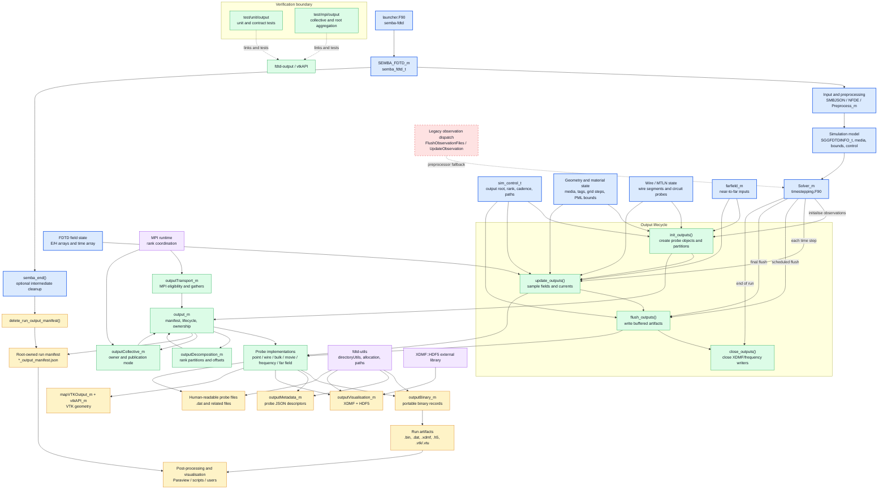

# Output Module Project Interactions

The output module is the runtime boundary between the FDTD solver state and
published simulation artifacts.
The diagram below describes the active new-output path selected by
`CompileWithNewOutputModule`.

## Lifecycle Contract

Initialisation creates one output object for each supported observation request
and prepares volumetric partitions when needed.
Updates consume the current solver fields and advance probe buffers.
Flushes persist scalar, wire, bulk, far-field, binary, and visualisation data.
The final flush requests far-field completion and then closes long-lived
writers.

The coordinator also owns output lifecycle metadata, canonical scalar-writer
selection, volumetric publication mode, and the root-owned run manifest.
The manifest is removed by `semba_end()` when intermediate-data cleanup is
requested.

The legacy branch remains in `timestepping.F90` behind the inverse preprocessor
condition and is explicitly scheduled for retirement in task `T19` of the
robust-output-layer plan.
