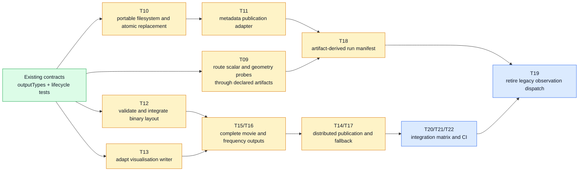

# Output Upgrades And Concerns

This note tracks the remaining work around `src_output`.
The authoritative task breakdown is
`specs/changes/robust-output-layer/tasks.md`.

## Priority Roadmap

## Pending Upgrades

- **Portable filesystem operations (`T10`).** Replace shell-dependent or
  platform-sensitive directory and file handling with native nested-directory
  creation and atomic replacement.
- **Complete artifact registration (`T09`, `T11`).** Point, wire, bulk,
  far-field, and map-VTK outputs still need consistent declared-artifact
  publication and final metadata coverage.
- **Binary contract integration (`T12`, `T15`, `T16`).** The binary writer
  exists, but every volumetric path must use it with a validated record size,
  precision, byte order, and complex real/imaginary convention.
- **Visualisation integration (`T13`, `T15`, `T16`).** Movie and frequency
  probes must reliably produce the complete XDMF/HDF5 pair and register both
  artifacts.
- **Distributed publication (`T14`, `T17`, `T21`).** Complete collective
  hyperslab publication and root-aggregation fallback, including deterministic
  participant order and no duplicate MPI boundary planes.
- **Manifest correctness (`T18`).** Derive the root-owned run manifest from
  declared artifacts and remove stale per-rank registration once parity is
  proven.
- **Legacy retirement (`T19`).** Remove the old observation dispatch only
  after the new output path has equivalent coverage.
- **Verification and CI (`T20` through `T22`).** Add serial, zero-sample,
  nested-path, spaced-path, distributed-collective, and distributed-aggregation
  coverage across supported build configurations.

## Current Concerns

- The output layer currently calls filesystem, metadata, binary,
  visualisation, and MPI-related helpers directly from the coordinator and
  probe modules.
  This makes portability and failure handling cross-cutting rather than
  isolated behind adapters.
- `attach_output_partition()` initialises `outputCollective_m` with collective
  publication disabled.
  The current volumetric path therefore selects root aggregation instead of
  exercising the collective XDMF/HDF5 path.
- The metadata writer opens files with `status='replace'`.
  A failed write can leave a partial descriptor, so completion must not be
  advertised until atomic replacement or an equivalent durability policy is
  implemented.
- The output library uses `vtkAPI_m` from `mapVTKOutput.F90`, but `vtkAPI` is a
  separate CMake target.
  The target dependency should remain explicit so module-generation and link
  ordering cannot depend on incidental build behaviour.
- `timestepping.F90` still contains both the new and legacy output branches.
  Any change to flush cadence or finalisation must be checked against both
  paths until `T19` is complete.
- Root aggregation is a correctness fallback, not a scalable default.
  Large volumetric probes can require root memory proportional to the complete
  requested volume.
- The output contract supports zero-sample probes, but end-to-end tests must
  verify that descriptors and required artifact declarations still exist when
  no samples are written.

## Related Diagrams

- [Module dependencies](output-module-dependencies.mermaid.md)
- [Project interactions](output-project-interactions.mermaid.md)
- [Robust output-layer plan](../specs/changes/robust-output-layer/plan.md)
- [Output metadata schema](../specs/changes/robust-output-layer/contracts/output-metadata-schema.md)
