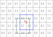
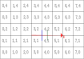

# The `smbjson` parser module

This module allows to read the [FDTD-JSON format](#the-fdtd-json-format) and parse it into the semba-fdtd data structures.

## Compilation and testing

### Compilation with GNU Fortran (Linux)

Assuming `gfortran` and `cmake` are accessible from path, this module can be compiled from the project main directory run

    cmake -S . -B <BUILD_DIR> -G Ninja
    cmake --build <BUILD_DIR> -j

### Compilation with Intel compilers (Windows)

Use the Intel provided scripts to set environment variables and use same command as for `gfortran`.

### Compilation with NVIDIA Fortran compiler

Not supported. Tested to work with `-O0` optimizations. Higher optimizations produce SEGFAULTs.

### Testing

This project uses the googletest. Once build, from project root folder run,

    <PATH_TO_BUILD>/bin/smbjson_tests

# The FDTD-JSON format

This format aims to provide a way to input data for a full FDTD simulation.
Being in JSON, it can be easily navigated with most text editors, such as Visual Studio Code or Notepad++. 
There are also multiple tools to read and write them.
This document assumes that you are familiar with the basic JSON notation, a brief explanation on this notation can be found [here](https://www.w3schools.com/js/js_json_syntax.asp).

The following are examples of valid inputs:

 1. An empty space illuminated by a plane wave: [planewave.fdtd.json](testData/cases/planewave.fdtd.json). The field at a point close to the center is recorded.
 2. A thin straight wire illuminated by a plane wave: [holland1981.fdtd.json](testData/cases/holland1981.fdtd.json) which aims to replicate the case described in https://doi.org/10.1109/TEMC.1981.303899. It contains a probe which records the wire at the middle of the wire.
 3. A current injection which mimics a lightning strike on a square metallic surface: [currentinjection.fdtd.json](testData/cases/currentInjection.fdtd.json). It contains two bulk current probes to measure the current at the entry and exit lines.
 4. A shielded pair of wires fed by a voltage source in one of its ends: [shieldedPair.fdtd.json](testData/cases/shieldedPair.fdtd.json). The interior of the shield uses a multiconductor transmission line (MTL) algorithm to evolve the common mode currents which are induced in the shield and propagated inside using a transfer impedance.
 5. A multiconductor transmission line network (MTLN) case which includes three cable bundles with a shared junction: [mtln.fdtd.json](testData/cases/mtln.fdtd.json).

## FDTD-JSON objects description

All units are assumed to be SI-MKS.

Angle brackets surrounding an entry, as in `<entry>`, indicate that that entry is mandatory.
Square brackets, as in `[entry]`, are optional entries.

The following entries are shared by several FDTD-JSON objects and have a common description:

+ `type` followed by a string, indicates the type of JSON object that. Some examples of types are `planewave` for `sources` objects, and `polyline` for `elements`.
+ `id` is a unique integer identifier for objects that belong to a list and which can be referenced by other objects. For instance, an element in the `elements` list must contain a `id` which can be referenced by a source in `sources` through its list of `elementIds`.
+ `[name]` is an optional entry which is used to make the FDTD-JSON input human-readable, helping to identify inputs and outputs. Leading and trailing blank spaces are removed. Blank spaces are substituted by underscroes. The following characters are reserved and can't be used in a `name`: `@`.

### `<general>`

This object must always be present and contains general information regarding the solver. It must contain the following entries:

+ `<timeStep>`: A real number indicating the time step used by the solver, in seconds. 
+ `<numberOfSteps>`: An integer for the number of steps which the solver will iterate.

Addtionally, it may contain the following optional entry:

+ `<mtlnProblem>` : A bool indicating whether the problem is a pure MTLN problem and will solved using only the MTLN solver. If it is not present, its default value is `false`
+ `<additionalArguments>` : A string with flags. Keep in mind that flags passed by console have higher priority. 

**Example:**

```json
"general": {
    "timeStep": 10e-12,
    "numberOfSteps": 2000,
    "additionalArguments": "-mapvtk -sgbc"
}
```

### `[boundary]`
This specifies the boundaries which will be used to terminate the computational domain. 
If `boundary` is not present it defaults to a `mur` absorbing condition in all bounds.
The entries within `boundary` are objects labelled with the place where they will be applied:

+ `all`, or
+ `xLower`, `xUpper`, `yLower`, `yUpper`, `zLower` `zUpper`.

These objects must contain a `<type>` label which can be:

+ `pec` for perfectly electric conducting termination.
+ `pmc` for perfectly magnetic conducting termination.
+ `periodic` for periodic boundary conditions. Must be paired with the opposite side. 
+ `mur` for Mur's first order absorbing boundary condition.
+ `pml` for perfectly matched layer termination. If this `type` is selected, it must also contain:

  + `[layers]`: with an integer indicating the number of pml layers which will be used. Defaults to $10$ layers
  + `[order]`: an integer indicating the order of the profile. defaults to order $2$.
  + `[reflection]`: Computed reflection coefficient, defaults to $0.001$.

**Example:**

```json
"boundary": {
    "all": {
        "type": "pml",
        "layers": 6, 
        "order": 2.0,
        "reflection": 0.001
    }
}
```

### `<mesh>`

All the geometrical information of the simulation case is exclusively stored by the `mesh` object. It is a JSON object which contains three objects: a `<grid>`, a list of `[coordinates]` and a list of `[elements]`.

```json
"mesh": {
    "grid": { ... },       
    "coordinates": [ ... ],
    "elements": [ ... ]    
}
```

#### `<grid>`
The `grid` object represents a collection of rectangular cuboids or *cells* which tessellate the space to form a structured mesh. This object is defined with the following entries:
- `<numberOfCells>` is an array of three positive integers which indicate the number of cells in each Cartesian direction.
- `<steps>` is an object which contains three arrays, labeled with `<x>`, `<y>` and `<z>` which represent the cell sizes, expressed in meters, in that direction. Each array may contain a single real to define a [regular grid](https://en.wikipedia.org/wiki/Regular_grid); or, alternatively, a number of reals equal to the number of cells to define a [rectilinear grid](https://en.wikipedia.org/wiki/Regular_grid).

The following example describes a regular grid with $20$, $20$, and $22$ cells in the $x$, $y$, and  $z$ directions respectively.
```json
"mesh": {
    "grid": {
        "numberOfCells": [20, 20, 22], 
        "steps": { "x": [0.1], "y": [0.1], "z": [0.1] }
    }
}
```

#### `[coordinates]`

This is an array of objects which represent Cartesian coordinates within the grid. Each object of the array must contain the following entries:

+ `<id>`: an integer number that must be unique within this array.
+ `<relativePosition>`: Containing an array of 3 numbers which can be integers or reals. The whole part of the number indicates the cell and the fractional part indicates the fractional position within that cell.

**Example:** The following figure represents a grid with the numbers of the cells marked in light gray. The third dimension is ignored for clarity. The two coordinates (blue) represent positions in the grid. Note that coordinate 2 has a fractional position in the $x$ direction.


```json
"mesh": {
    "grid": {
        "numberOfCells": [8, 5, 1], 
        "steps": { "x": [0.1], "y": [0.1], "z": [0.1] }
    }
    "coordinates": [
        {"id": 1, "relativePosition": [2, 2, 0]},
        {"id": 2, "relativePosition": [3.4, 1, 0]}
    ]
}
```

#### `[elements]`

The `elements` entry contains an array of JSON objects, each of which represents a geometrical entity. Within the context of this format specification, an *element* can be a relatively simple entity such as `node` or a `polyline`, but it can also be a much more complex geometrical entity such as a `cell`.  An *element objects* must contain the entries

+ `<id>` formed by an integer which uniquely identifies it within the `elements` array.
+ `<type>` which can be one of the following: 

  + `node`, representing a point in space. Elements with this type include a `<coordinateIds>` entry which is an array of a single integer representing the `id` of a coordinate and which must exist in the within the `mesh` `coordinates` list.
  + `polyline`, representing an oriented collection of segments. It must contain a list `<coordinateIds>` with at least two coordinates.
  + `cell`, containing a list of one or more `<intervals>` defined following the [interval convention](#the-interval-convention).

Below there is an example of a mesh object which includes several types of elements.

```json
"mesh": {
    "grid": {
        "numberOfCells": [20, 20, 22],
        "steps": { "x": [0.1], "y": [0.1], "z": [0.1] }
    },
    "coordinates": [
        {"id": 1, "relativePosition": [11, 11,  7]},
        {"id": 2, "relativePosition": [11, 11, 12]},
        {"id": 3, "relativePosition": [11, 11, 17]}
    ],
    "elements": [
        {"id": 1, "type": "node", "coordinateIds": [2]},
        {"id": 2, "type": "polyline", "coordinateIds": [1, 2, 3] },
        {"id": 3, "type": "cell", "intervals": [ [ [1, 1, 1], [19, 19, 21] ] ] }
    ]
}
```

##### The `interval` convention

A `interval` is defined by a pair of two triplets of integer numbers $\mathbf{a} = \{a_x, a_y, a_z\}$ and $\mathbf{b} = \{b_x, b_y, b_z\}$. Each of these triplets refers to a cell and the combination of the two represents a region formed by the closed-open intervals $[a_x, b_x) \times [a_y, b_y) \times [a_z, b_z)$.
The size of the interval is defined as $|a_x - b_x| \times |a_y - b_y| \times |a_z - b_z|$ and therefore must be positive or zero.
An interval allows specifying regions within the grid which can be a point, an oriented line, an oriented surface, or a volume:

+ A *point* is defined when $\mathbf{a} = \mathbf{b}$, i.e. the intersection of three grid planes. Points have no orientation.

+ An *oriented line* is defined when the interval has the same initial and ending values in all directions except one, for instance $a_x \neq b_x$. In this case there are two possibilities:

  + when $(b_x - a_x) > 0$, the line is oriented towards $+\hat{x}$.
  + when $(b_x - a_x) < 0$, the line is oriented towards $-\hat{x}$. 

+ An *oriented surface* is defined when one initial and ending value is the same and the other two are different, e.g. $a_x = b_x$, $a_y \neq b_y$, $a_z \neq b_z$. In this case there are four possibilities:
  
  + when the $(b_y - a_y) > 0$ and $(b_z - a_z) > 0$, the surface normal is assumed to be oriented towards $+\hat{x}$.
  + when the $(b_y - a_y) < 0$ and $(b_z - a_z) < 0$, the surface normal is assumed to be oriented towards $-\hat{x}$.
  + The other two cases, in which there is a mix of positive and negative signs, are undefined.

+ A *volume* is defined when each component of $\mathbf{a}$ is strictly smaller than the corresponding component in $\mathbf{b}$ for each direction, i.e. $a_x < b_x$, $a_y < b_y$, and $a_z < b_z$. The rest of the cases in which all numbers are different but not necessarily smaller are undefined.

**Example:** The following figure represents a grid with the numbers of the cells marked in light gray. The third dimension is ignored for clarity. There are four `cell` elements. 

+ The first one represents a single rectangular surface with its normal oriented towards the $+\hat{z}$ direction (light green).
+ The second one is formed by an square surface oriented towards the $-\hat{z}$ direction (light red) and a line oriented towards $-\hat{x}$.
+ The third is formed by two oriented lines towards $+\hat{x}$ and $+\hat{y}$, respectively.
+ Finally, the fourth `cell` is formed by a single line, oriented towards $-\hat{y}$.


```json
"mesh": {
    "grid": {
        "numberOfCells": [8, 5, 1], 
        "steps": { "x": [0.1], "y": [0.1], "z": [0.1] }
    }
    "elements": [
        {"id": 1, "type": "cell", "intervals": [ [[1,1,0], [2,3,0]] ]},
        {"id": 2, "type": "cell", "intervals": [ [[3,5,0], [2,4,0]],
                                                       [[5,4,0], [3,4,0]] ]},
        {"id": 3, "type": "cell", "intervals": [ [[3,2,0], [5,2,0]],
                                                       [[5,2,0], [5,3,0]] ]},
        {"id": 4, "type": "cell", "intervals": [ [[7,3,0], [7,0,0]] ]},
    ]
}
```

## `[materials]`
This entry is an array formed by all the physical models contained in the simulation. Each object within the array must contain:

+ `<id>`, an integer number that uniquely identifies the material.
+ `<type>`, with one of the allowed labels described below.

### Bulk materials

### `pec` and `pmc`

These materials represent a perfectly electrically conducting (`pec`) and perfectly magnetically conducting (`pmc`).

**Example:**

```json
"materials": [ {"id": 1, "type": "pec"} ]
```

### `isotropic`

A `material` with `type` `isotropic` represents an isotropic material with constant (not frequency dependent) relative permittivity $\varepsilon_r$, relative permeability $\mu_r$, electric conductivity $\sigma$ and/or magnetic conductivity $\sigma_m$:

+ `[relativePermittivity]` is a real which defaults to $1.0$. Must be greater than $1.0$.
+ `[relativePermeability]` is a real which defaults to $1.0$. Must be greater than $1.0$.
+ `[electricConductivity]` is a real which defaults to $0.0$. Must be greater than $0.0$.
+ `[magneticConductivity]` is a real which defaults to $0.0$. Must be greater than $0.0$.

**Example:**

```json
{
    "name": "teflon",
    "id": 1, 
    "type": "isotropic",
    "relativePermittivity": 2.5,
    "electricConducitivity": 1e-6
} 
```

### `lumped`

A `material` with `type` `lumped` represents a lumped circuit `model`, e.g a resistor. Lumped materials can only be assigned to `cell` `elements` with `intervals` describing oriented lines. If multiple cells are assigned to a lumped element, only the first one of them will be treated as a lumped by the solver, the other cells will be treated as a PEC material.
The specific behavior is described using the `<model>` keyword, described below. `resistor`, `inductor` and `capacitor` are based, with some additions, on the following reference

```
    Liu, Y., Mittra, R., Su, T., Yang, X., & Yu, W. (2006). Parallel finite-difference time-domain method. Artech.
    Chapter 3, Section 5.
```

#### `resistor` model

Defined by:
+ `<resistance>` a positive real number.
+ `[startingTime]` and `[endTime]` are the times in which the resistor will be active. Default to $0.0$ and $1.0$ seconds, respectively. When deactivated, the backgroung material properties will be used, i.e. the edge will be equivalent to an open circuit at low frequencies.

**Example:**

```json
{
    "name": "100_ohm_resistor",
    "id": 1, 
    "type": "lumped",
    "model": "resistor",
    "resistance": 100,
    "startingTime": 0.0,
    "endTime": 1.0
} 
```

#### `inductor` model
A series $LR$ circuit, $R$ is optional:
+ `<inductance>` a positive real number
+ `[resistance]` a positive or zero real number. Defaults to $0.0$.

#### `capacitor` model
A parallel $CR$ circuit:
+ `<capacitance>` a positive real number
+ `<resistance>` a positive real number.


### `multilayeredSurface`

A `multilayeredSurface` must contain the entry `<layers>` which is an array indicating materials which are described in the same way as [isotropic materials](#isotropic) and a `<thickness>`.
Its `elementIds` must reference `cell` elements. All `intervals` modeling entities different to oriented surfaces are ignored.

```json
{
    "name": "Composite",
    "type": "multilayeredSurface",
    "id": 2,
    "layers": [
        {"thickness": 1e-3, "relativePermittivity": 1.3, "electricConductivity": 2e-4},
        {"thickness": 5e-3, "relativePermittivity": 1.3},
        {"thickness": 1e-3, "relativePermittivity": 1.3, "electricConductivity": 2e-4}
    ]
}
```

### `thinSlot`

A `thinSlot` represents a gap between two conductive surfaces. Therefore it must be located at a surface and be defined using line cell elements only. Its `<width>` is a real number which defines the distance between the surfaces in meters.

```json
{
    "name": "3mm-gap",
    "type": "thinSlot",
    "id": 2,
    "width": 3e-3
}
```

### `wire`

A `wire`, or *thin wire*, represents an electrically conducting wire-like structure with a radius much smaller than the surrounding cell sizes. 
These structures are solved by an algorithm similar to the one described in:

```
R. Holland and L. Simpson, 
"Finite-Difference Analysis of EMP Coupling to Thin Struts and Wires," 
IEEE Transactions on Electromagnetic Compatibility, vol. EMC-23, no. 2, pp. 88-97, May 1981,
doi: 10.1109/TEMC.1981.303899.
```

Materials of this type must contain:

+ `<radius>` as a real number.
+ `<resistancePerMeter>` as a real number.
+ `[inductancePerMeter]` as a real number. Defaults to `0.0`.

**Example:**

```json
{
    "name": "Shield",
    "id": 2,
    "type": "wire",
    "radius": 0.0001,
    "resistancePerMeter": 22.9e-3
}
```

A single wire might be surrounded by a dielectric material. In that case, the radius and the relative permittivity of the material are needed. 

**Example:**

```json
{
    "name": "WireWithDielectric",
    "id": 2,
    "type": "wire",
    "radius": 0.0001,
    "resistancePerMeter": 22.9e-3,
    "dielectric" : {"radius": 0.001, "relativePermittivity" : 3}
}
```
If the `dielectric` field is present but any of `radius` or `relativePermittivity` is absent, the parsing of the dielectric will fail.

### `multiwire`

A `multiwire`, models $N+1$ electrical wires inside a bundled. The voltages and currents on these wires are solved by a multiconductor transmission lines (MTLN) solver described in:

    Paul, C. R. (2007). Analysis of multiconductor transmission lines. John Wiley & Sons.

`multiwire` materials are assumed to be contained within a `wire` or another `multiwire` which is the external domain and is used as voltage reference. 
They must contain the following entries:

+ `<inductancePerMeter>` and `<capacitancePerMeter>` which must be matrices with a size $N \times N$.
+ `[resistancePerMeter]` and `[conductancePerMeter]` which must be arrays of size $N$. Defaults to zero.
+ `[transferImpedancePerMeter]` which represents the coupling with the external domain, described below. If not present, it defaults to zero, i.e. perfect shielding.

If the number of wires of the `multiwire` is equal to 1, none of the properties above are scalars:

+ `<inductancePerMeter>` and `<capacitancePerMeter>` will be a $1 \times 1$ matrix, i.e `[[1e-7]]` 
+ `[resistancePerMeter]` and `[conductancePerMeter]` will be arrays of size $1$, i.e `[50]`

`transferImpedancePerMeter` can contain:

+ `[resistiveTerm]` defined by a real representing transfer impedance resistance. Defaults to `0.0`
+ `[inductiveTerm]` defined by a real representing transfer impedance inductance. Defaults to `0.0`.
+ `[direction]` which can be `both`, `inwards`, or `outwards`. Indicating the type of coupling considered. Defaults to `both` meaning that fields can couple from the exterior to interior and the other way round.

**Example:**

```json
{
    "name": "Bundle_2_level_2",
    "id": 62,
    "type": "multiwire",
    "resistancePerMeter" : [62.0e-3,62.0e-3],
    "inductancePerMeter": [
        [2.4382084E-07, 4.7377505E-08],
        [4.7377508E-08, 2.4382081E-07]
    ],
    "capacitancePerMeter": [
        [105.5e-12, -20.5e-12],
        [-20.5e-12, 105.5e-12 ]
    ],
    "transferImpedancePerMeter" : {
        "inductiveTerm" : 4.2e-9,
        "direction" : "inwards"
    }
}
```

### `terminal`

A `terminal` models a lumped circuit which is assumed to located at one end of a `wire` or `multiwire`. Terminals are assumed to be assigned on points and therefore have zero dimension.

+ If the terminal is associated with a `wire`, the `terminations` array must contain a single `termination`.
+ In the case it is associated with a $N+1$ conductors `multiwire`, the `terminations` array must contain $N$ entries.

Each entry in `terminations` is specified by a `type`

+ `short` if the wire is short-circuited with another wire or with any surface which might be present.
+ `open` if the wire does not end in an ohmic contact with any other structure.
+ Different configurations of passive circuit elements R, L, and C can be defined with `series` (for RLC series circuits), `LCpRs` (LC parallel in series with a resistance) and `RLsCp` (for series RL in parallel with C). The are defined as follows:
  + `[resistance]` which defaults to `0.0`,
  + `[inductance]` which defaults to `0.0`,
  + `[capacitance]` which defaults to `1e22`.
+ 2-port SPICE models can used in a termination. In this case the `type` is `circuit`, and is defined with:
  + `[file]` which is the name of the file where the SPICE model is defined 
  + `[name]` which is the name of the subcircuit as defined inside `file`

There is an optional key which is needed in case the termination is attached to a N-port circuit, `circuitPort`. This must be an integer which indicates to which port in the circuit defined in the [subcircuits](#subcircuits) is attached.

**Example:**

```json
{
    "name": "shieldTerminal",
    "id": 4,
    "type": "terminal",
    "terminations": [ {"type": "series", "resistance": 50.0} ]
}
```
#### `SPICE terminations`

As with the rest of terminations, SPICE terminations have to be equivalents to 2-port networks, i.e, the model in `file` can be composed of an arbitrary number of components, but it must have only two external nodes. 

**Example:**

```json
{
    "name": "SpiceTerminal",
    "id": 5,
    "type": "terminal",
    "terminations": [ {"type": "circuit", "file": "ListOfComponents.lib", "name": "Component_1"} ]
}
```

`ListOfComponents.lib` is a file where one or more SPICE subcircuits are defined. The file does not need to contain only the subcircuit that is going to be used in the termination. The particular subcircuit among those defined in the file is selected using the key `name`.

### `connector`

The `connector` represents the physical connection of a bundle to a structure. `connector` assigns properties to the initial or last segment of a `wire` or a `multiwire`. 
This `wire` can be either a single wire or the outermost conductor of a `cable` bundle. The `conector`  can have the following properties:

+ `[resistances]`, an array of $N$ real numbers which will be converted to resistances per unit length and will replace the resistancePerMeter of that segment of the multiwire
+ `[transferImpedancePerMeter]`, described in the same way as explained in the [multiwire](#multiwire) section. Only valid in a `connector` associated with `multiwire`.


**Example:**

```json
{
    "name": "SegmentConnector1",
    "id": 204,
    "type": "connector",
    "resistance": 100e-3,
    "transferImpedancePerMeter" : {
        "resistiveTerm" : 3.33,
        "inductiveTerm" : 2.6e-9,
        "direction" : "inwards"
    }
}
```

## `[materialAssociations]`

This entry stores associations between `materials` and `elements` using their respective `id`s as follows:

+ `<materialId>`: A single integer indicating the `id` of a material which must be present in the `materials` list.
+ `<elementIds>`: A list of `id`s of the elements to which this material will be associated.


Material associations with bulk or surface materials such as `pec`, `pmc` or `isotropic` can be assigned to one or many elements of type `cell`. If the `cell` contains `intervals` representing points, these will be ignored.

```json
"materialAssociations": [
    {"materialId": 1, "elementIds": [2]},
    {"materialId": 1, "elementIds": [3]}
]
```

Associations with cables can contain the following inputs:

+ `<initialTerminalId>` and `<endTerminalId>` which must be present within the `materials` list of type. These entries indicate the lumped circuits connected at the ends of the cable.
+ `[initialConnectorId]` and `[endConnectorId]` entries which must point to materials of type `connector` and are assigned to the last segments of the corresponding ends of the cable.
+ Its `materialId` must point to a [`wire`](#wire) or a [`multiwire`](#multiwire) material. If it points to a `multiwire`, it must also contain an entry named `<containedWithinElementId>` which indicates the `polyline` in which this `multiwire` is embedded.

**Example:**

```json
{
    "name": "line_0_0",
    "elementIds": [ 1 ],
    "materialId": 10,
    "initialTerminalId": 20,
    "endTerminalId": 7,
    "initialConnectorId": 24
}
```

## `[subCircuits]`

A series of terminals connected together (belonging to the same junction) can be connected to a N-port SPICE circuit. In that case, each of these *junction circuits* have to described separately in the `subCircuits` section.
This section stores associations between `materials` of type `circuit` and `elements` using their respective `id`s as follows:

+ `<materialId>`: A single integer indicating the `id` of a material of type `circuit` which must be present in the `materials` list.
+ `<elementIds>`: A list of with a single `id`. This id must correspond to an element of type `node`, associated to the `coordinateId` shared by all the polylines connected to the subcircuit.
+ `<name>`: A **unique** name that will be used to identify the ports of the subcircuit.

If a terminal represents a connection to a subcircuit described in this sections, the key `circuitPort` has to be present in the description of the terminal.

## `[probes]`

The objects in the `probes` array define the outputs of the simulation. Each probe must contain:

+ A `<type>` of the ones described below.
+ `<elementIds>` indicating the place in which the probe is defined. The allowed `elements` depend on the particular probe `type`.
+ A `[domain]` as described in the [domain section](#domain)

### Probe types

#### `point`

Records a vector field a single position referenced by `elementIds` which must contain a single `id` referencing an element of type `node`. The vector field to be recorded is selected using the following entries:

+ `[field]`, `electric` or `magnetic`. Defaults to `electric`.
+ `[directions]` which contains a list of the field components to be recorded. Defaults to `["x", "y", "z"]`.

**Example:**

```json
{
    "name": "electric_field_point_probe",
    "type": "point",
    "field": "electric",
    "elementIds": [1],
    "directions": ["x", "y", "z"],
    "domain": { "type": "time" }
}
```

#### `wire`

Records a scalar field at a single position referenced by `elementIds`. `elementIds` must contain a single `id` referencing an element of type `node`. Additionally, this `node` must point to a `coordinateId` belonging to at least one `polyline`. 
If the node's `coordinateId` is shared by more than one `polyline` a probe will be defined for each one of them
The `[field]` can be `voltage`, `current` or `charge`  (defaults to `current`). Voltage probes are properly defined only when used placed on MTL bundles. The voltage on a conductor will be referred to the shield surrounding that conductor. In an unshielded wire, there is not a well defined reference, and thus the probe is not reliable. Charge probes are implemented only for wires not treated with the MLT module.

When `current` is selected, the orientation of the `polyline` on which the probe is located indicates the direction of the current. Voltages are well defined at polyline points. However, currents are defined over segments so:

- If the point is in the interior of the wire, the output will be an average on the currents of the segments which are contiguous to it.
- If the point is at one wire end, the current will be the output of the last segment.

```json
{
    "name": "mid_point",
    "type": "wire",
    "field": "voltage",
    "elementIds": [1]
}
```

#### `bulkCurrent`

Performs a loop integral along on the contour of the surface reference in the `elementIds` entry. This must point to a single `cell` containing a single `interval` which is used to define one or several surfaces. These surfaces are build by enlarging half grid step in the directions perpendicular to the entry `direction` which can take one of the following values: `x`, `y` or `z`. Depending on the type of `interval`, `direction` can be assumed (and therefore is optional), or not, specifically:

+ If it is a point or a volume, `direction` must be present.
+ For an oriented line, `direction` is optional and the orientation of the line will be used as default.
+ For an oriented surface, `direction` is also optional, and if not value is given it is assumed to be the the positive axis of the surface normal.

Due to Ampere's law, the loop integral of the magnetic field is equal to the total electric current passing through the surfaces. `[field]`, can be `electric` or `magnetic`. Defaults to `electric`, which returns the total current passing through the surface.

In the following example `elementId` points an element describing a single oriented surface, therefore `direction` does not need to be stated explicitly.

```json
{
    "name": "bulk_current_at_surface",
    "type": "bulkCurrent",
    "elementIds": [4]
}
```

In this example `elementId` points to a volume element, therefore `direction` must be present

```json
{
    "name": "bulk_current_at_volume",
    "type": "bulkCurrent",
    "elementIds": [8],
    "direction": "x"
}
```

One important aspect to keep in mind when working with `bulkCurrent` with `electric field type` is its natural offset. This arises from the fact that to measure the electric current it is necessary to calculate the closed path integral of the magnetic field, then, the electric current is defined on the **dual mesh** of the inserted grid—i.e., the mesh corresponding to the magnetic field. The **dual mesh** is constructed by placing a point at the center of each cell in the original (primal) mesh and connecting these points.

Because of this, the code internally shifts the `bulkCurrent` you define to align with the dual mesh, causing a **half-cell offset**. In the case of surfaces, the coordinates **perpendicular** to the current flowing through the surface experience a **negative offset**, as shown in the figure below:




If the current is flowing out of the page and the defined `bulkCurrent` corresponds to the blue surface, the algorithm will actually evaluate the current on the green surface. Mathematically, this can be interpreted as follows: if the `bulkCurrent` is defined as a rectangle with bounds `[a, b] × [c, d]`, the measurement is performed on the **half-open domain** `[a, b) × [c, d)`.

On the other hand, the coordinate **parallel** to the current also experiences a **half-cell offset**, but this time in the **positive direction**, as illustrated in the figure below:



Again, with the current flowing in the direction of the red line, the blue line represents a cross-sectional view of the plane where the `bulkCurrent` is defined, while the green line shows the actual location used for current evaluation by the method.

#### `line`

A `line` probe computes the electric field line integral along a given `polyline`. At low frequencies, this quantity can be equivalent to a DC voltage difference between the extremes of the line. At higher frequencies, "voltage" is no longer a proper name. The integral is performed along a geometric line, hence the `polyline` does not have to be associated with any material. 

```json
    {
        "name" : "vprobe",
        "type" : "line",
        "elementIds" : [4]
    }
```

#### `farField`

Probes of type `farField` perform a near to far field transformation of the electric and magnetic vector fields and are typically located in the scattered field region which is defined by a total/scatterd field excitation, e.g. [a planewave](#planewave). 
They must be defined with a single `cell` element which must contain a single `interval` defining a cuboid. 
The direction of  the radiated field $\hat{r}(\theta, \phi)$ is defined with `<theta>` and `<phi>`, which must contain `<initial>`, `<final>`, and `<step>`, expressed in degrees.
The `domain` of a `farField` probe can only be of type `frequency`.
If not `magnitudeFile` is specified and only one `source` is defined, the `magnitudeFile` of that source will be used to calculate as normalizing function.


```json
{
    "name": "far_field_example",
    "type": "farField",
    "elementIds": [4],
    "theta": {"initial": 0, "final": 180, "step": 10},
    "phi": {"initial": 0, "final": 0, "step": 0},
    "domain": {
        "type": "frequency",
        "initialFrequency": 1e6,
        "finalFrequency": 1e9,
        "numberOfFrequencies": 30,
        "frequencySpacing": "logarithmic"
    }
}
```

#### `movie`

Probes of type `movie` record a vector field in a volume region indicated by `elementIds`. `[field]` can be `electric`, `magnetic`, or `currentDensity`; defaults to `electric`.
`currentDensity` will store only the surface density currents on `pec` or lossy surfaces.
For movies in time domain, the `initialTime`, `finalTime`, and `samplingPeriod` must be specified by the user; there is no default value.  
The stored values can be selected using the `[component]` entry, which stores one of the following labels `x`, `y`, `z`, or `magnitude`; if no component is specified, defaults to `magnitude`.

An example follows:
```json
{
    "name": "electric_field_movie",
    "type": "movie",
    "field": "electric",
    "component": "x",
    "elementIds": [4]
}
```

### `[domain]`

If `domain` is not specified, it defaults to a time domain recording from the beginning to the end of the simulation.
The domain must specify a `<type>` from the following ones:

+ `time`, means recording only in time domain. A probe with a `domain` of this `type` can contain the following entries:

  + `[initialTime]`, the probe will be active for times greater than or equal to the selected value. Defaults to 0.0.
  + `[finalTime]`, the probe will be active for times smaller than the selected value. Defaults to the final time of the simulation.
  + `[samplingPeriod]`. Defaults to the simulation time step which is the minimum sampling period.

+ `frequency`, means that the output will be converted into the frequency domain.
  + `<initialFrequency>`, `<finalFrequency>` as real numbers, and `<numberOfFrequencies>` as an integer.
  + `[frequencySpacing]` can be `linear` or `logarithmic`. Defaults to `linear`.

+ `timeFrequency` will record both time and frequency.

Additionally, a `domain` can contain a `[magnitudeFile]` as specified in [sources](#sources). This file will be used as to compute a *transfer function* between the recorded output and the specified magnitude.


## `[sources]`

This entry is an array which stores all the electromagnetic sources of the simulation case. Each source is a JSON object which must contain the following entries:

+ `<magnitudeFile>` contains a relative path to the plain text file which will be used as a magnitude for this source. This file must contain two columns, with the first stating the time and the second one the magnitude value; an example magnitude file can be found at [gauss.exc](testData/cases/gauss.exc).
+ `<type>` must be a label of the ones defined below. Some examples of source `type` are `planewave` or `nodalSource`.
+ `<elementIds>` is an array of integers which must exist within the `mesh` `elements` list. These indicate the geometrical place where this source is located. The `type` and number of the allowed elements depends on the source `type` and can be check in the descriptions of each source object, below.

### `planewave`

The `planewave` type represents an electromagnetic wave with a plane phase-front which propagates towards a $\hat{k}$ direction and with an electric field pointing towards $\hat{E}$.
`elementIds` must point to a single `cell` element formed by a single cuboid region which defines the total and scattered field regions, respectively.
Besides the other common entries in [sources](#sources), it must also contain the following ones:

+ `<direction>`, is an object containing `<theta>` and `<phi>`, which are the angles of the propagation vector $\hat{k} (\theta, \phi)$.
+ `<polarization>`, is an object containing `<theta>` and `<phi>` which indicates the direction of the electric field vector $\hat{E}(\theta, \phi)$.

An example of a planewave propagating towards $\hat{z}$ and polarized in the $+\hat{x}$ follows,

```json
{
    "type": "planewave",
    "magnitudeFile": "gauss.exc",
    "elementIds": [2],
    "direction": {
        "theta": 0.0,
        "phi": 0.0
    },
    "polarization": {
        "theta": 1.5708,
        "phi": 0.0
    }
}
```

### `nodalSource`

This object represents a time-varying vector field applied along an oriented line with the same orientation of the line. Therefore, the `elementIds` within must contain only elements of type `cell` with `intervals` describing a collection of oriented lines. Additionally, it may contain:

+ `[field]` with a `current` label which indicates the vector field which will be applied. If not present, it defaults to `current`.
+ `[hardness]` with `soft` or `hard` label. A `soft` hardness indicated that the magnitude will be **added** to the field this situation is typical for a waveport. `hard` sources mean that the field is **substituted** by the value established by the `magnitudeFile`, which for an electric field `nodalSource` would be equivalent to a `pec` material if the magnitude is zero.

**Example:**

```json
{
    "name": "entry_line_curent",
    "type": "nodalSource", 
    "magnitudeFile": "gauss.exc", 
    "elementIds": [1],
    "hardness": "soft",
    "field": "electric"
}
```

### `generator`

A `generator` source must be located on a single `node` whose `coordinateId` is used by a single `polyline`. The entry `[field]` can be `voltage` or `current`; defaults to `voltage`.

**Example:**

```json
{
    "name": "voltage_source",
    "type": "generator",
    "field": "current",
    "magnitudeFile": "gauss.exc", 
    "elementIds": [1]
}
```

In case the generator is located at the junction (connection point) of two of more lines, the  `node` shared by the lines will share the same  `coordinateId`. If more than two lines are connected together, it is necessary to know to which of the lines the generator is connected to. The entry `[attachedToLineId]` is an integer which refers to the `elemId` of the `polyline` the source is connected to. 

**Example:**

```json
{
    "name": "voltage_source",
    "type": "generator",
    "field": "voltage",
    "magnitudeFile": "gauss.exc", 
    "elementIds": [1], 
    "attachedToLineId" : 2
}
```
