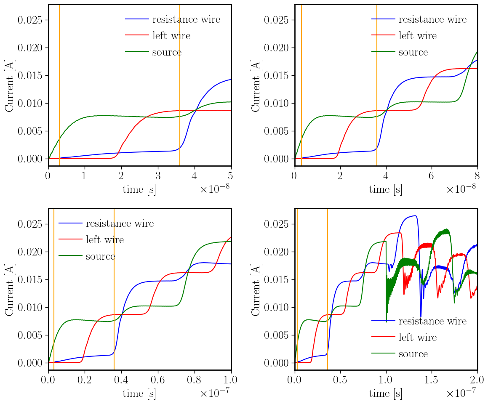

# Example `smbjson` from The Big Misconception About Electricity

This JSON models the problem presented in [The Big Misconception About Electricity](https://www.youtube.com/watch?v=bHIhgxav9LY) by Veritasium. The general structure of the JSON can be found in the [FDTD-JSON format](https://github.com/OpenSEMBA/fdtd/blob/main/doc/smbjson.md).

## JSON layout in the example case

Each object in the JSON is shown for the example case. As indicated in [smbjson.md](https://github.com/OpenSEMBA/fdtd/blob/main/doc/smbjson.md), all units are assumed to be SI-MKS.

### `general`

The simulation time is defined using `<timeStep>` and `<numberOfSteps>`. It is important to note that the solver may not end up using the values defined by the user for these parameters, as it optimizes them according to other problem parameters, but the total simulation time remains the same (i.e. `<timeStep>` x `<numberOfSteps>`).

**Example:**

```json
"general": {
    "timeStep": 2.0e-9,
    "numberOfSteps": 100
},
```

### `boundary`

All boundaries of the domain are set as PML to simulate free space and prevent wave reflections at the edges. You must specify the number of layers, the variation of conductivity across layers, and the reflection coefficient after the waves pass through all PML layers.

**Example:**

```json
"boundary": {
    "all": {
        "type": "pml",
        "layers": 10,
        "order": 2.0,
        "reflection": 0.001
    }
},
```

### `mesh`

Contains the spatial discretization information using the `grid`, `coordinates`, and `elements` objects.

### `grid`

Defines the computational domain, the region of 3D space where the FDTD method is applied. `<numberOfCells>` indicates the number of total cells in each direction, and `<steps>` specifies their size (in SI units, i.e., meters).

**Example:**

```json
"grid": {
    "numberOfCells": [210, 300, 200],
    "steps": {"x": [0.1], "y": [0.1], "z": [0.1]}
}
```

### `coordinates`

Defines the coordinates of the points in the computational domain defined in `grid`. It is important that the points are not located on the edge of the region but have sufficient cells around them to avoid artifacts. The geometry of the problem is reduced to a rectangle formed by wires, as shown in the example. Note that the rectangle lies in the plane z = 10. The x and y coordinates are chosen so that the rectangle has dimensions 1 x 10 (in SI units, not in terms of cells). In all directions, there is a 10-meter gap between the wire and the domain boundaries.

**Example:**

```json
"coordinates": [
    {"id": 1, "relativePosition": [100, 149, 100]},
    {"id": 2, "relativePosition": [100, 100, 100]},
    {"id": 3, "relativePosition": [110, 100, 100]},
    {"id": 4, "relativePosition": [110, 150, 100]},
    {"id": 5, "relativePosition": [110, 200, 100]},
    {"id": 6, "relativePosition": [100, 200, 100]},
    {"id": 7, "relativePosition": [100, 151, 100]}
]
```

### `elements`

Elements are assigned to the coordinates defined above or by specifying intervals in the computational domain.

- Wires: use `"type": "polyline"` to form the rectangle.
- Node: use `"type": "node"` to place the current generator.
- Planes: use `"type": "cell"` to place probes.
- Cube: use `"type": "cell"` to assign resistances to planes.

**Example:**

```json
"elements": [
    {"id": 1, "type": "polyline", "coordinateIds": [1, 2, 3, 4, 5, 6, 7]},
    {"id": 2, "type": "node", "coordinateIds": [4]},
    {"id": 3, "type": "cell", "name": "cube", "intervals": [ [ [99, 149, 99], [101, 151, 101] ] ]},
    {"id": 4, "type": "cell", "name": "wire-plane", "intervals": [ [ [105, 99, 99], [105, 101, 101] ] ]},
    {"id": 5, "type": "cell", "name": "source-plane", "intervals": [ [ [109, 150, 99], [111, 150, 101] ] ]},
    {"id": 6, "type": "cell", "name": "cube-plane", "intervals": [ [ [98, 150, 98], [102, 150, 102] ] ]},
    {"id": 7, "type": "cell", "name": "movie-domain", "intervals": [ [ [80, 80, 80], [130, 220, 120] ] ]},
]
```

### `materials`

Defines the materials assigned to each element in the system. The following are used:

- `"wire_material"`: a conductive material representing a wire (`"type": "wire"`), using a very small radius (`"radius": 0.0001`) and nearly zero resistance per meter (`"resistancePerMeter": 22.9e-3`).

- `"resistance_material"`: a terminal-type material (`"type": "terminal"`) defined as a 50.0-ohm resistor (`"resistance": 50.0`).

- `"cube_material"`: a PEC-type material (`"type": "pec"`), which offers no resistance to current flow.

**Example:**

```json
"materials": [
    {
        "id": 1,
        "name": "wire_material",
        "type": "wire",
        "radius": 0.0001,
        "resistancePerMeter": 22.9e-3
    },
    {
        "id": 2,
        "name": "resistance_material",
        "type": "terminal",
        "terminations": [
            {"type": "series", "resistance": 50.0}
        ]
    },
    {
        "id": 3,
        "name": "cube_material",
        "type": "pec"
    }
]
```

### `materialAssociations`

Assigns the `materials` to the `elements` defined in the `mesh`. The `"wire_material"` is assigned to the polyline that defines the rectangle, turning it into a wire rectangle. `"cube"` is assigned the `"pec"` material to avoid problems when introducing the resistance planes.

**Example:**

```json
"materialAssociations": [
    {
        "name": "wire_association",
        "elementIds": [1],
        "materialId": 1,
        "initialTerminalId": 2,
        "endTerminalId": 2
    },
    {
        "name": "cube_association",
        "elementIds": [3],
        "materialId": 3
    }
]
```

### `sources`

Defines the source to simulate a voltage generator (`"field": "voltage"`), using `"type": "generator"`. The `"step.exc"` file must be generated in the preprocessing phase and should be a sigmoid function sustained over time to visualize the expected behavior. The generator should be placed in front of the resistor, in `"coordinateIds": [4]`.

**Example:**

```json
"sources": [
    {
        "name": "source_generator",
        "type": "generator",
        "magnitudeFile": "step.exc",
        "elementIds": [2],
        "field": "voltage"
    }
]
```

### `probes`

Defines probes to monitor the simulation. Two `"type"`s are used: `"bulkCurrent"` and `"movie"`.

- `"bulkCurrent"` is used to measure electric current at various circuit points. From the `"elementIds"`, measurements are made at the generator, a wire point, and the resistor.
- `"movie"` records a vector field over the volume defined in `"elementIds": [7]"`. The `"component": "magnitude"` simulates the field strength, and the `"initialTime"`, `"finalTime"`, and `"samplingPeriod"` define the time span and resolution.

**Example:**

```json
"probes": [
    {
        "name": "wire_current",
        "type": "bulkCurrent",
        "elementIds": [4]
    },
    {
        "name": "source_current",
        "type": "bulkCurrent",
        "elementIds": [5]
    },
    {
        "name": "cube_current",
        "type": "bulkCurrent",
        "elementIds": [6]
    },
    {
        "name": "cube_wave_current",
        "type": "bulkCurrent",
        "elementIds": [8]
    },
    {
        "name": "movie_electric",
        "type": "movie",
        "field": "electric",
        "component": "magnitude",
        "elementIds": [7],
        "initialTime": 0.0, 
        "finalTime": 2e-7, 
        "samplingPeriod": 2e-8
    }
]
```

## A simple use case in Python: preprocessing, program call & postprocessing of results

This section illustrates a complete FDTD simulation workflow using the `pyWrapper` Python interface to interact with an external electromagnetic solver. The procedure includes three stages: generation of the excitation signal, execution of the solver via a wrapped call, and an example of how postprocessing could be performed.

### Preprocessing: signal definition
We define time-domain voltage signals used as excitations for the simulation. Two different types are shown: a Gaussian pulse and a sigmoid-shaped signal. The values are saved as two-column plain text files with time and voltage:

**Example:**
```python
import numpy as np
import matplotlib.pyplot as plt

# Define time vector
dt = 6e-9
tf = 6e-7
t = np.arange(0, tf, dt)

# Gaussian pulse
t0 = 3e-7
sigma = 3e-7
v = 10.0 * np.exp(-(t - t0)**2 / (2 * sigma**2))

# Save as two-column text file
data = np.column_stack((t, v))
np.savetxt('./gauss.exc', data)
```

Similarly, a sigmoid excitation can be defined:
**Example:**
```python
t = np.linspace(0, 10e-8, 2000)
A = 10
k = 30e7
t0 = 0.1e-8

sigmoid_raw = 1 / (1 + np.exp(-k * (t - t0)))
offset = 1 / (1 + np.exp(k * t0))
scaling = 1 / (1 - offset)
V = A * (sigmoid_raw - offset) * scaling

data = np.column_stack((t, V))
np.savetxt('./step.exc', data)
```
In this case, this is the data file which we referenced in `"magnitudeFile"` when we defined the source of the circuit, in `sources`.

### Solver invocation via pyWrapper
The core of the simulation is executed by calling an external FDTD solver through the `pyWrapper` interface. This requires specifying a JSON input file and the path to the solver binary. Internally, this wraps a call to the C++ executable and manages its outputs:

**Example:**
```python
from pyWrapper import FDTD
import os

# Set path to SEMBA executable (anonymized)
SEMBA_EXE = '/path/to/semba-fdtd'

# Define input JSON file
fn = 'closedCircuit.fdtd.json'

# Instantiate and run the solver
solver = FDTD(input_filename=fn, path_to_exe=SEMBA_EXE, flags=['-mapvtk'])
solver.cleanUp()    # We clean old results
solver.run()
```

The `FDTD` object handles setup, execution, and optional cleanup of temporary files. The `-mapvtk` flag enables VTK output generation for visualization.

### Example postprocessing: current traces
As a postprocessing example, we load and plot current traces at different points in the simulated structure. These output files are automatically generated by the solver and saved in plain text format, but data can be accessed through the `solver` object, as seen in [SGBC shielding effectiveness](https://github.com/OpenSEMBA/fdtd/blob/main/testData/cases/sgbcShieldingEffectiveness/sgbc_prepost.py) example. File paths have been anonymized:

**Example:**
```python
import matplotlib.pyplot as plt

# Load current data from different regions (filenames anonymized)
data1 = np.loadtxt('resistance_current.dat', skiprows=1)
data2 = np.loadtxt('left_wire_current.dat', skiprows=1)
data3 = np.loadtxt('source_current.dat', skiprows=1)

# Plot the results
plt.figure(figsize=(8, 9))
plt.plot(data1[:,0], -data1[:,1], label='resistance', color='blue')
plt.plot(data2[:,0], data2[:,1], label='left wire', color='red')
plt.plot(data3[:,0], data3[:,1], label='source', color='green')

plt.axvline(x=0.3e-8, color='orange', linestyle='-', label='1/c')
plt.axvline(x=3.6e-8, color='orange', linestyle='-', label='11/c')

plt.xlabel('Time [s]')
plt.ylabel('Current [A]')
plt.grid(True)
plt.legend()
plt.xlim(right=1e-7)
plt.show()
```



